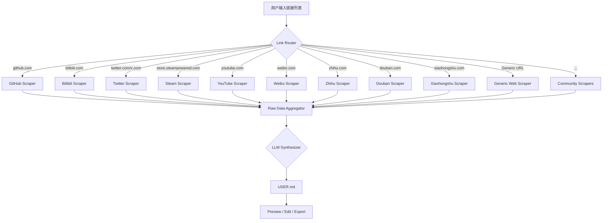

# ProfileForge — AI-Powered USER.md Generator

> 用户提供社交链接 → AI 爬取公开信息 → 生成个性化的 OpenClaw `USER.md`

---

## 1. 核心理念

**目标用户**：任何使用 OpenClaw（或类似 AI Agent）的人，希望 Agent 从第一秒就了解自己。

**核心流程**：
```
用户粘贴链接 → Link Router 识别平台 → 对应 Scraper 提取数据 → LLM 合成 → 输出 USER.md
```

---

## 2. 字段策略：Fixed Skeleton + AI-Generated Sections

> [!IMPORTANT]
> 不采用纯固定字段（会有大量空字段），也不采用纯自由格式（不稳定）。采用混合方案。

### 固定骨架（每个用户必有）

| 字段 | 说明 | 数据来源 |
|------|------|---------|
| **Name** | 真名或常用昵称 | GitHub bio / 社交平台主页 |
| **Aliases** | 各平台用户名总表 | 所有输入链接 |
| **Timezone** | 时区 | GitHub location / 用户手动确认 |
| **Language** | 偏好语言 | 内容语言分析 |
| **Summary** | 一句话描述这个人 | AI 综合生成 |

### AI 动态 Section（根据爬到的内容自主决定）

AI 的核心指令：
> "根据抓到的公开信息，**自主决定**生成哪些 Section。不生成空字段。每个字段必须对 AI 助理日常交互有实际帮助。"

示例映射：

| 如果发现... | 生成 Section | 内容示例 |
|------------|-------------|---------|
| GitHub 大量 Repo | `## Technical Skills` | Python, PyTorch, CV |
| Bilibili/YouTube 有视频 | `## Content Creation` | UP 主，主题：AI 工具/Vocaloid |
| Twitter/微博有观点 | `## Interests & Opinions` | 对 AI 安全的看法 |
| 博客/知乎有长文 | `## Writing & Knowledge` | 技术深度文，偏学术风格 |
| Steam/游戏平台 | `## Gaming` | Elden Ring, Cyberpunk 2077 |
| Spotify/网易云 | `## Music Taste` | J-Pop, Vocaloid, Lo-fi |
| 豆瓣有标记 | `## Cultural Taste` | 电影/书籍/音乐品味 |
| LinkedIn/简历 | `## Career & Education` | HKUST(GZ), ML Research |
| 小红书/Instagram | `## Lifestyle` | 旅行、美食、穿搭 |

### 固定尾部

| 字段 | 说明 |
|------|------|
| `## Interaction Guidelines` | AI 总结的交互建议（语气、禁忌、偏好） |
| `## Sources` | 生成此文件所用的所有链接 |
| `_Generated by ProfileForge vX.X_` | 版本水印 |

---

## 3. 全平台 Scraper 规格

### 🧑‍💻 开发者平台

| 平台 | 提取内容 | 数据获取方式 | 优先级 |
|------|---------|------------|--------|
| **GitHub** | Bio, Repos（名称+描述+语言+Star）, Pinned Repos, README.md, Organizations, Contribution 频率 | GitHub REST API v3（无需 token 可用，有 rate limit；有 token 更好） | 🔴 必做 |
| **GitLab** | Bio, Projects, Languages | GitLab REST API | 🟡 |
| **Dev.to** | Bio, 文章标题+标签+反应数 | Dev.to API (Forem) | 🟡 |
| **Medium** | Bio, 文章标题+标签 | RSS Feed 解析 | 🟡 |
| **Hashnode** | Bio, 文章标题+标签 | GraphQL API | 🟢 |
| **Stack Overflow** | 用户 Bio, Top Tags, 声望 | Stack Exchange API | 🟢 |
| **个人网站/博客** | About 页面内容, 文章主题 | HTTP + Trafilatura（正文提取库） | 🔴 必做 |

### 📺 视频平台

| 平台 | 提取内容 | 数据获取方式 | 优先级 |
|------|---------|------------|--------|
| **Bilibili** | 用户名, Bio, 等级, 视频标题+标签+播放量, 动态内容 | Bilibili 内部 API（JSON 返回） | 🔴 必做 |
| **YouTube** | Channel 名称, Bio, 视频标题+标签, Playlists | YouTube Data API v3（需 API Key） | 🔴 必做 |
| **TikTok / 抖音** | Bio, 视频主题标签 | Scraping（受限，需 Playwright） | 🟢 |

### 💬 社交媒体

| 平台 | 提取内容 | 数据获取方式 | 优先级 |
|------|---------|------------|--------|
| **Twitter / X** | Bio, Pinned Tweet, 最近 Tweets 主题 | X API v2（需 Bearer Token）或 Scraping | 🔴 必做 |
| **微博 (Weibo)** | Bio, 最近微博主题, 标签 | 微博 API / Scraping | 🟡 |
| **小红书 (Xiaohongshu)** | Bio, 笔记主题, 标签 | Scraping（无公开 API） | 🟡 |
| **Instagram** | Bio, 内容主题 | Scraping（受限） | 🟢 |
| **Threads** | Bio, 帖子主题 | Meta API / Scraping | 🟢 |
| **Mastodon / Bluesky** | Bio, 帖子主题 | 各自 REST API | 🟢 |

### 📚 知识/问答平台

| 平台 | 提取内容 | 数据获取方式 | 优先级 |
|------|---------|------------|--------|
| **知乎 (Zhihu)** | Bio, 关注话题, 高赞回答的主题 | Scraping | 🟡 |
| **Reddit** | Bio, 订阅 Subreddits, 高赞帖子主题 | Reddit API (OAuth) | 🟡 |
| **Quora** | Bio, 热门回答主题 | Scraping | 🟢 |

### 🎮 游戏平台

| 平台 | 提取内容 | 数据获取方式 | 优先级 |
|------|---------|------------|--------|
| **Steam** | 用户名, 游戏库（名称+游戏时长）, 最近游戏, 成就 | Steam Web API（需 API Key） | 🔴 必做 |
| **PlayStation Network** | 用户名, 奖杯, 最近游戏 | Scraping / 第三方 API | 🟢 |
| **Xbox / Game Pass** | 用户名, Gamerscore, 最近游戏 | Xbox API | 🟢 |

### 🎵 音乐平台

| 平台 | 提取内容 | 数据获取方式 | 优先级 |
|------|---------|------------|--------|
| **Spotify** | Top Artists, Top Tracks, Playlists | Spotify Web API（需 OAuth） | 🟡 |
| **网易云音乐 (NetEase)** | 用户名, 歌单, 最近听歌 | 内部 API / Scraping | 🟡 |
| **Apple Music** | Playlists（受限） | 无公开 API，仅支持分享链接解析 | 🟢 |
| **QQ 音乐** | 歌单, 最近听歌 | 内部 API / Scraping | 🟢 |

### 💼 职业平台

| 平台 | 提取内容 | 数据获取方式 | 优先级 |
|------|---------|------------|--------|
| **LinkedIn** | Title, Company, Skills, Education, Summary | Scraping（受限，需 Playwright + 登录态） | 🟡 |
| **Google Scholar** | 论文列表, 引用数, 研究领域 | Scholar Scraping / Serpapi | 🟡 |

### 🎬 文化/品味平台

| 平台 | 提取内容 | 数据获取方式 | 优先级 |
|------|---------|------------|--------|
| **豆瓣 (Douban)** | 电影/书籍/音乐 标记+评分 | Scraping | 🟡 |
| **Letterboxd** | 电影标记+评分+影评 | RSS / Scraping | 🟢 |
| **Goodreads** | 书籍标记+评分+书评 | RSS / Scraping | 🟢 |
| **MAL (MyAnimeList)** | 动漫标记+评分 | MAL API (Jikan) | 🟢 |
| **Bangumi** | 动漫/游戏标记+评分 | Bangumi API | 🟢 |

---

## 4. 技术架构



### 插件化 Scraper 架构

每个 Scraper 是独立模块，遵循统一接口：

```python
class BaseScraper(ABC):
    """所有 Scraper 的基类"""
    
    # 该 Scraper 支持识别的 URL 模式
    url_patterns: list[str]  # e.g., ["github.com/*", "raw.githubusercontent.com/*"]
    
    @abstractmethod
    async def scrape(self, url: str, config: ScraperConfig) -> ScrapedData:
        """抓取并返回结构化数据"""
        ...
    
    @abstractmethod
    def get_platform_name(self) -> str:
        """返回平台名称"""
        ...
```

**社区贡献**：任何人可以通过实现 `BaseScraper` 来添加新平台支持，放入 `scrapers/` 目录即可自动注册。

### LLM Synthesizer Prompt

```
你是 ProfileForge，一个 USER.md 生成器。

任务：根据以下用户的公开信息，生成适用于 OpenClaw AI 助理的用户画像。

规则：
1. 必须包含固定骨架：Name, Aliases, Timezone, Language, Summary
2. 根据实际数据自主决定额外 Section（不限数量和类型）
3. 禁止生成空字段或占位符
4. 每个字段必须对 AI 助理有实际交互价值
5. 语气是"对 AI 说的"（"User prefers..."），不是对人说的
6. 生成 Interaction Guidelines 告诉 AI 怎么与这个人交流
7. Markdown 格式，简洁有力
8. 过滤敏感信息（邮箱、手机号、身份证号等）

用户的公开信息：
---
{aggregated_scraped_data}
---

请生成 USER.md：
```

---

## 5. 使用方式

### CLI
```bash
# 基本用法
profileforge \
  --link https://github.com/ReinerBRO \
  --link https://space.bilibili.com/352089037 \
  --link https://store.steampowered.com/id/xxx \
  --output USER.md

# 指定 LLM 模型
profileforge --link ... --model openai:gpt-4o

# 直接安装到 OpenClaw
profileforge --link ... --install
# → 自动写入 ~/.openclaw/workspace/USER.md

# 从文件批量读取链接
profileforge --links-file my_links.txt --output USER.md

# 交互模式（逐步确认）
profileforge --interactive
```

### Web UI
- 输入框粘贴多条链接
- 实时显示各平台爬取进度
- 预览生成的 USER.md，支持在线编辑
- 导出 / 一键拷贝

### OpenClaw Skill
```
你: 帮我生成个人档案，这些是我的链接：github.com/xxx, bilibili.com/xxx
AI: 收到！正在分析你的 3 个链接...
AI: 生成完成！要我更新你的 USER.md 吗？
```

---

## 6. 项目结构

```
profileforge/
├── README.md
├── LICENSE (MIT)
├── pyproject.toml
├── profileforge/
│   ├── __init__.py
│   ├── cli.py                    # CLI 入口
│   ├── router.py                 # Link Router（URL → Scraper 分发）
│   ├── synthesizer.py            # LLM Synthesizer
│   ├── output.py                 # USER.md 输出/安装
│   ├── config.py                 # 配置（API Keys 等）
│   ├── models.py                 # 数据模型（ScrapedData 等）
│   ├── scrapers/
│   │   ├── __init__.py           # 自动注册所有 Scraper
│   │   ├── base.py               # BaseScraper 抽象类
│   │   ├── github.py
│   │   ├── bilibili.py
│   │   ├── twitter.py
│   │   ├── youtube.py
│   │   ├── steam.py
│   │   ├── weibo.py
│   │   ├── zhihu.py
│   │   ├── douban.py
│   │   ├── xiaohongshu.py
│   │   ├── spotify.py
│   │   ├── netease_music.py
│   │   ├── linkedin.py
│   │   ├── reddit.py
│   │   ├── medium.py
│   │   ├── devto.py
│   │   ├── stackoverflow.py
│   │   ├── google_scholar.py
│   │   ├── mal.py
│   │   ├── bangumi.py
│   │   ├── generic.py            # 通用网页 Scraper（兜底）
│   │   └── ...                   # 社区贡献的 Scraper
│   └── utils/
│       ├── http.py               # HTTP 请求封装
│       ├── browser.py            # Playwright 浏览器控制
│       └── privacy.py            # 敏感信息过滤
├── tests/
│   ├── test_router.py
│   ├── test_synthesizer.py
│   ├── scrapers/
│   │   ├── test_github.py
│   │   ├── test_bilibili.py
│   │   └── ...
│   └── fixtures/                 # Mock 数据
│       ├── github_profile.json
│       ├── bilibili_profile.json
│       └── ...
└── web/                          # Web UI（可选）
    ├── ...
```

---

## 7. 隐私与安全

> [!CAUTION]
> 只使用 **公开可访问** 的信息。

| 原则 | 实现 |
|------|------|
| **只爬公开数据** | 不要求登录态（LinkedIn 等受限平台标注为"受限"） |
| **敏感信息过滤** | `privacy.py` 自动过滤邮箱、手机号、身份证号、地址等 |
| **本地处理** | 所有数据只在用户本地处理，不上传到任何第三方（除 LLM API） |
| **用户确认** | 生成结果必须用户确认后才写入 `USER.md` |
| **透明来源** | `## Sources` 列出所有使用的链接，用户知道信息从哪来 |

---

## 8. 验证方案

| 类型 | 方法 | 命令 |
|------|------|------|
| **单元测试** | 每个 Scraper 用 mock fixture 测试解析逻辑 | `pytest tests/scrapers/ -v` |
| **集成测试** | 端到端：输入链接 → 生成 USER.md → 验证格式 | `pytest tests/test_e2e.py -v` |
| **LLM 输出校验** | 验证生成的 USER.md 包含固定骨架字段 | `pytest tests/test_synthesizer.py -v` |
| **隐私过滤测试** | 验证敏感信息被正确移除 | `pytest tests/test_privacy.py -v` |
| **真实场景** | 用自己的链接运行 → 放入 OpenClaw → 验证 Agent 理解度 | 手动 |
