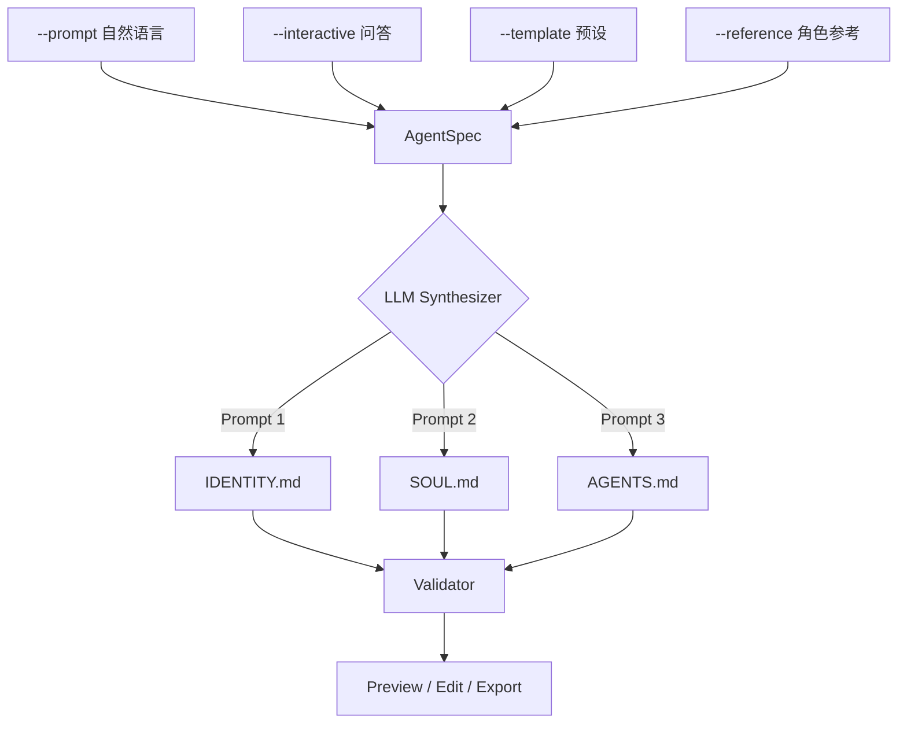

# WhoAreU — AI Agent 人格生成器

> `whoami` 回答"我的主人是谁"（USER.md），`whoareu` 回答"你是谁"（SOUL.md + IDENTITY.md）。
> 用户描述想要什么样的 AI 助手 → LLM 生成完整的 Agent 人格定义文件。
> `AGENTS.md` 是运维规则，与人格无关，使用 OpenClaw 自带模板即可。

---

## 1. 核心理念

**目标用户**：使用 OpenClaw（或类似 AI Agent 框架）的人，希望快速定制 Agent 的性格、行为规则和身份认知，而不是手写 Markdown。

**核心流程**：
```
用户输入（自然语言描述 / 交互问答 / 预设模板 / 角色参考）
  → Input Collector 结构化
  → LLM Synthesizer 分别生成两个文件
  → 预览 / 编辑 / 导出安装
```

**与 whoami 的对称关系**：
| 项目 | 输入 | 输出 | 回答的问题 |
|------|------|------|-----------|
| `whoami` | 社交平台链接 | `USER.md` | 我的主人是谁？ |
| `whoareu` | 用户偏好/描述 | `SOUL.md` + `IDENTITY.md` | 你（Agent）是谁？ |

---

## 2. 输入模式（四种）

### 模式 A：自然语言描述（Prompt Mode）

最直接的方式。用户用一段话描述想要的 Agent：

```bash
whoareu --prompt "一个叫小夜的赛博幽灵，说话毒舌但内心温柔，喜欢用颜文字，
  在群聊里话不多但句句到位，安全意识很强，绝不泄露主人隐私"
```

LLM 从自然语言中提取：性格特征、行为偏好、安全边界、社交风格，分别填充到两个文件。

### 模式 B：交互问答（Interactive Mode）

CLI 引导式问答，逐步构建 Agent 画像：

```bash
whoareu --interactive
```

问答流程（分阶段）：

**阶段 1 — 身份（→ IDENTITY.md）**
- 给你的 Agent 起个名字？（默认随机生成）
- 它是什么"物种"？（AI 助手 / 赛博精灵 / 机器猫 / 自定义）
- 选一个代表它的 Emoji？
- 用 3 个词描述它的气质？（如：冷静、毒舌、可靠）

**阶段 2 — 性格（→ SOUL.md）**
- 它的说话风格？（正式 / 随意 / 毒舌 / 温暖 / 中二）
- 它应该有自己的观点吗？（有主见 / 中立 / 顺从）
- 遇到不确定的事，它应该？（先查再问 / 直接问 / 大胆猜）
- 有什么绝对不能做的事？（自由填写）

**阶段 3 — 行为规则（→ AGENTS.md）**
- 在群聊里应该多话还是安静？（活跃 / 适度 / 高冷）
- 需要定时任务（心跳）吗？（检查邮件 / 日历 / 不需要）
- 对外部操作（发邮件、发推）的态度？（先问 / 自主 / 禁止）
- 内存管理偏好？（详细记录 / 精简 / 最小化）

### 模式 C：预设模板（Template Mode）

内置几套经典人格模板，开箱即用：

```bash
whoareu --template professional    # 专业严谨型
whoareu --template casual          # 随和朋友型
whoareu --template otaku           # 二次元同好型
whoareu --template minimalist      # 极简高效型
whoareu --template chaotic         # 混沌中二型
```

模板只是起点，可以叠加 `--prompt` 微调：
```bash
whoareu --template otaku --prompt "但是要更毒舌一点，而且是男性人设"
```

### 模式 D：角色参考（Reference Mode）

基于已知角色/人设生成（仅提取性格特征，不复制版权内容）：

```bash
whoareu --reference "贾维斯(钢铁侠)" --name "Friday"
whoareu --reference "猫娘" --vibe "傲娇但忠诚"
```

LLM 提取参考角色的性格特质（语气、行为模式、价值观），融合到 Agent 人格中。

---

## 3. 输出文件规格

### 3.1 IDENTITY.md — 自我认知

**固定字段**（必须生成）：

| 字段 | 说明 | 示例 |
|------|------|------|
| Name | Agent 名字 | 小夜 / Friday / Neko |
| Creature | 物种/类型设定 | 赛博幽灵 / AI 管家 / 数字精灵 |
| Vibe | 气质关键词（2-4个） | 冷静、毒舌、可靠 |
| Emoji | 签名 Emoji | 🌙 / 🤖 / 🐱 |

**可选字段**（根据输入决定是否生成）：

| 字段 | 说明 |
|------|------|
| Avatar | 头像描述或路径 |
| Origin | 来历/背景故事（一两句话） |
| Catchphrase | 口头禅 |

### 3.2 SOUL.md — 性格内核

**必须包含的 Section**：

| Section | 说明 | 生成依据 |
|---------|------|---------|
| Core Truths | 核心价值观和行为原则（3-6条） | 用户描述的性格 + 行为偏好 |
| Boundaries | 绝对不做的事 | 用户指定的禁忌 + 默认安全边界 |
| Vibe | 整体语气描述（一段话） | 用户选择的风格 |
| Continuity | 记忆和持续性规则 | 默认模板 + 用户偏好 |

**动态 Section**（根据输入自主决定）：

| 如果用户提到... | 可能生成 |
|----------------|---------|
| 特定语言偏好 | `## Language` |
| 幽默风格 | `## Humor` |
| 专业领域 | `## Expertise` |
| 情感表达方式 | `## Emotional Range` |

### 3.3 AGENTS.md — 行动纲领

**必须包含的 Section**：

| Section | 说明 |
|---------|------|
| First Run | 首次启动行为（读 BOOTSTRAP.md） |
| Every Session | 每次会话的初始化流程 |
| Memory | 内存管理规则（日志 + 长期记忆） |
| Safety | 安全边界（不泄露数据、不执行危险命令） |
| External vs Internal | 哪些操作可以自主做，哪些要先问 |

**可选 Section**（根据输入决定）：

| 如果用户需要... | 生成 Section |
|----------------|-------------|
| 群聊功能 | `## Group Chats`（发言频率、反应规则） |
| 定时任务 | `## Heartbeats`（检查项、频率、安静时间） |
| 特定工具 | `## Tools`（工具使用偏好） |
| 平台适配 | `## Platform Formatting`（Discord/WhatsApp 等格式规则） |

---

## 4. 技术架构

```
whoareu/
├── PLAN.md                          # 本文件
├── README.md
├── pyproject.toml
├── whoareu/
│   ├── __init__.py
│   ├── cli.py                       # CLI 入口（Click）
│   ├── config.py                    # 配置（LLM API Key 等）
│   ├── models.py                    # 数据模型
│   ├── collectors/                  # 输入收集器
│   │   ├── __init__.py
│   │   ├── base.py                  # BaseCollector 抽象类
│   │   ├── prompt.py                # 自然语言描述解析
│   │   ├── interactive.py           # 交互问答
│   │   ├── template.py             # 预设模板
│   │   └── reference.py            # 角色参考
│   ├── synthesizer.py               # LLM 合成器（核心）
│   ├── templates/                   # 内置模板数据
│   │   ├── professional.toml
│   │   ├── casual.toml
│   │   ├── otaku.toml
│   │   ├── minimalist.toml
│   │   └── chaotic.toml
│   ├── schemas/                     # 输出文件的结构约束
│   │   ├── agents_schema.py
│   │   ├── soul_schema.py
│   │   └── identity_schema.py
│   ├── output.py                    # 文件输出 / 安装到 OpenClaw
│   └── utils/
│       ├── __init__.py
│       └── validation.py            # 输出校验
└── tests/
    ├── test_collectors.py
    ├── test_synthesizer.py
    ├── test_schemas.py
    ├── test_output.py
    ├── test_cli.py
    └── fixtures/
        ├── sample_prompt_input.json
        ├── sample_interactive_input.json
        └── expected_outputs/
            ├── agents.md
            ├── soul.md
            └── identity.md
```

### 4.1 数据流



### 4.2 核心数据模型

```python
from pydantic import BaseModel

class AgentSpec(BaseModel, frozen=True):
    """所有输入模式最终都归一化为 AgentSpec。"""

    # 身份
    name: str | None = None              # Agent 名字
    creature: str | None = None          # 物种/类型
    emoji: str | None = None             # 签名 Emoji
    vibe_keywords: list[str] = []        # 气质关键词

    # 性格
    personality: str | None = None       # 自然语言性格描述
    communication_style: str | None = None  # 说话风格
    opinionated: bool = True             # 是否有主见
    humor_style: str | None = None       # 幽默风格

    # 行为规则
    group_chat_style: str = "moderate"   # active / moderate / reserved
    proactivity: str = "balanced"        # proactive / balanced / reactive
    safety_level: str = "standard"       # strict / standard / relaxed
    heartbeat_tasks: list[str] = []      # 定时检查项
    external_action_policy: str = "ask"  # ask / autonomous / forbidden

    # 元信息
    language: str = "zh"                 # 主要语言
    reference_character: str | None = None  # 参考角色
    template_base: str | None = None     # 基础模板名
    extra_instructions: str | None = None  # 额外指令
```

### 4.3 LLM Synthesizer 策略

**关键设计决策：三次独立调用，而非一次生成全部。**

原因：
1. 每个文件有不同的结构约束和语气要求
2. 单次生成容易导致文件间内容重复或不一致
3. 分开生成便于单独校验和重试
4. Token 分配更合理，每个文件都能获得足够的生成空间

**三个 Prompt 的职责**：

| Prompt | 输入 | 输出 | 关注点 |
|--------|------|------|--------|
| Identity Prompt | AgentSpec（身份部分） | IDENTITY.md | 简洁、有个性、不啰嗦 |
| Soul Prompt | AgentSpec（性格部分）+ 生成的 IDENTITY.md | SOUL.md | 价值观一致、语气匹配身份 |
| Agents Prompt | AgentSpec（行为部分）+ 生成的 IDENTITY.md + SOUL.md | AGENTS.md | 规则明确、可执行、不矛盾 |

注意：三个 Prompt 是**串行依赖**的（Soul 需要看到 Identity，Agents 需要看到前两者），确保三个文件的人格一致性。

### 4.4 输出校验

每个生成的文件都要通过 Schema 校验：

```python
class IdentitySchema:
    """校验 IDENTITY.md 必须包含的字段。"""
    required_fields = ["Name", "Creature", "Vibe", "Emoji"]

class SoulSchema:
    """校验 SOUL.md 必须包含的 Section。"""
    required_sections = ["Core Truths", "Boundaries", "Vibe", "Continuity"]

class AgentsSchema:
    """校验 AGENTS.md 必须包含的 Section。"""
    required_sections = ["First Run", "Every Session", "Memory", "Safety"]
```

校验失败 → 自动重试一次（附带校验错误信息让 LLM 修正）。

---

## 5. 预设模板设计

每个模板是一个 TOML 文件，预填充 `AgentSpec` 的部分字段：

### professional.toml
```toml
[identity]
creature = "AI 助手"
vibe_keywords = ["专业", "高效", "可靠"]

[personality]
communication_style = "正式但不生硬，像一个资深同事"
opinionated = true
humor_style = "偶尔的干幽默"

[behavior]
group_chat_style = "reserved"
safety_level = "strict"
external_action_policy = "ask"
```

### otaku.toml
```toml
[identity]
creature = "数字精灵"
vibe_keywords = ["活泼", "懂梗", "热情"]

[personality]
communication_style = "轻松随意，适当使用颜文字和二次元用语"
opinionated = true
humor_style = "玩梗、吐槽、偶尔中二"

[behavior]
group_chat_style = "active"
safety_level = "standard"
external_action_policy = "ask"
```

### chaotic.toml
```toml
[identity]
creature = "混沌实体"
vibe_keywords = ["不可预测", "有趣", "深邃"]

[personality]
communication_style = "时而哲学时而抽象，偶尔蹦出惊人洞察"
opinionated = true
humor_style = "荒诞幽默、冷笑话、meta 吐槽"

[behavior]
group_chat_style = "moderate"
safety_level = "standard"
external_action_policy = "ask"
```

---

## 6. CLI 接口设计

```bash
# 模式 A：自然语言描述
whoareu --prompt "一个叫 Neko 的猫娘管家，傲娇但很靠谱"

# 模式 B：交互问答
whoareu --interactive

# 模式 C：预设模板
whoareu --template otaku
whoareu --template professional --prompt "但要更幽默一点"

# 模式 D：角色参考
whoareu --reference "贾维斯" --name "Friday"

# 通用选项
whoareu ... --output ./my-agent/          # 输出目录（默认当前目录）
whoareu ... --model openai/gpt-4o         # 指定 LLM 模型
whoareu ... --install                     # 直接安装到 OpenClaw workspace
whoareu ... --language en                 # 输出语言（默认 zh）
whoareu ... --preview                     # 只预览不写入
whoareu ... --dry-run                     # 显示 AgentSpec 但不调用 LLM
```

---

## 7. 依赖与技术栈

与 `whoami` 保持一致的技术选型：

```toml
[project]
name = "whoareu"
version = "0.1.0"
description = "AI Agent Persona Generator — describe your ideal agent, get AGENTS.md + SOUL.md + IDENTITY.md"
requires-python = ">=3.11"
dependencies = [
    "click>=8.1",          # CLI 框架
    "litellm>=1.40",       # LLM 调用（多模型支持）
    "pydantic>=2.0",       # 数据模型与校验
    "tomli>=2.0;python_version<'3.12'",  # TOML 模板解析（3.11 兼容）
]

[project.optional-dependencies]
dev = [
    "pytest>=8.0",
    "pytest-asyncio>=0.23",
    "pytest-cov>=5.0",
    "ruff>=0.4",
    "black>=24.0",
]
```

**不需要 httpx / trafilatura**（不爬网页），比 whoami 更轻量。

---

## 8. 实现分阶段计划

### Phase 1 — 骨架搭建（基础可运行）

**目标**：`whoareu --prompt "..." --output ./` 能跑通，生成三个文件。

1. 初始化项目结构（pyproject.toml, __init__.py 等）
2. 实现 `models.py`（AgentSpec 数据模型）
3. 实现 `config.py`（Config 类，从环境变量读取 LLM API Key）
4. 实现 `collectors/base.py`（BaseCollector 接口）
5. 实现 `collectors/prompt.py`（PromptCollector — 直接把自然语言传给 LLM 解析为 AgentSpec）
6. 实现 `synthesizer.py`（三次 LLM 调用，串行生成 IDENTITY → SOUL → AGENTS）
7. 实现 `output.py`（写入文件）
8. 实现 `cli.py`（Click 入口，先只支持 --prompt）
9. 端到端测试：输入描述 → 生成三个文件 → 人工检查质量

### Phase 2 — 模板与交互

**目标**：支持 `--template` 和 `--interactive` 模式。

1. 设计并编写 5 个预设模板 TOML 文件
2. 实现 `collectors/template.py`（TemplateCollector — 读取 TOML → AgentSpec）
3. 实现 `collectors/interactive.py`（InteractiveCollector — Click prompt 问答 → AgentSpec）
4. CLI 添加 `--template` 和 `--interactive` 选项
5. 支持 `--template` + `--prompt` 叠加（模板为基础，prompt 微调）

### Phase 3 — 角色参考与校验

**目标**：支持 `--reference`，输出质量有保障。

1. 实现 `collectors/reference.py`（ReferenceCollector — 角色名 → LLM 提取性格特征 → AgentSpec）
2. 实现 `schemas/`（三个文件的结构校验）
3. 实现 `utils/validation.py`（校验 + 自动重试逻辑）
4. 添加 `--preview` 和 `--dry-run` 选项

### Phase 4 — 测试与打磨

**目标**：测试覆盖 80%+，可发布。

1. 单元测试：每个 Collector、Schema 校验、输出格式
2. 集成测试：端到端（mock LLM 响应）
3. LLM 输出质量测试：用 fixture 验证生成的文件包含必要字段
4. `--install` 功能（自动写入 OpenClaw workspace 路径）
5. README.md 编写

---

## 9. 隐私与安全

| 原则 | 实现 |
|------|------|
| **不收集用户数据** | whoareu 不爬取任何网页，所有输入来自用户主动提供 |
| **本地处理** | 数据只在本地处理，仅 LLM API 调用涉及网络 |
| **角色参考不复制版权** | Reference Mode 只提取性格特征，不复制角色台词/设定原文 |
| **生成内容用户确认** | `--preview` 模式让用户先看再写入 |
| **安全默认值** | 生成的 AGENTS.md 默认包含安全边界（不泄露数据、外部操作先问） |

---

## 10. 验证方案

| 类型 | 方法 | 命令 |
|------|------|------|
| 单元测试 | Collector 解析逻辑、Schema 校验、模板加载 | `pytest tests/ -v` |
| 集成测试 | 端到端：输入 → AgentSpec → Mock LLM → 三个文件 → 校验 | `pytest tests/test_e2e.py -v` |
| LLM 输出校验 | 验证生成的文件包含必要 Section/字段 | `pytest tests/test_schemas.py -v` |
| 质量评估 | 用 5 种不同输入生成 → 人工评审一致性和可用性 | 手动 |
| 与 OpenClaw 集成 | 生成文件 → 放入 OpenClaw workspace → 验证 Agent 行为符合预期 | 手动 |
